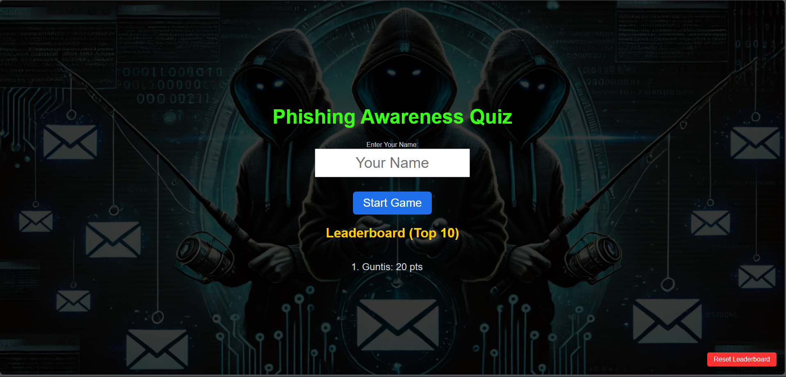

# Phishing Game



## Overview

The Phishing Game is an educational awareness game designed to help users learn how to identify phishing emails and messages.  
It provides a safe environment to practice recognizing common phishing techniques.

---

## Project Structure

- `phishing_game.html`  
  Main game file. Open this file to start the game.

- `phishing_game_styles.css`  
  Stylesheet used for the game layout and design.

- `scripts.js`  
  Main game logic and functionality.

- `questions.js`  
  Contains phishing scenarios and questions.

- `emails.png`, `emails1.png`, `phishing.png`  
  Image assets used in the game.

---

## How to Use

### Option 1: Clone the Repository

1. Clone the repository:
   ```bash
   git clone https://github.com/Guntis91/Phishing-Game.git
```

2. Open the project folder:
```bash
cd Phishing-Game
```

3. Open phishing_game.html in any web browser:

- Double-click the file

- Or right-click and choose Open with browser

### Option 2: Download as ZIP

1. Download the repository as a ZIP file from GitHub.

2. Extract the ZIP file.

3. Open phishing_game.html in any web browser.

No server or installation is required.
The game runs entirely in the browser.

## Purpose

This project is intended for educational and awareness purposes only.
It helps users improve their ability to recognize phishing attempts in a safe and controlled environment.

## Technologies Used

- HTML

- CSS

- JavaScript

